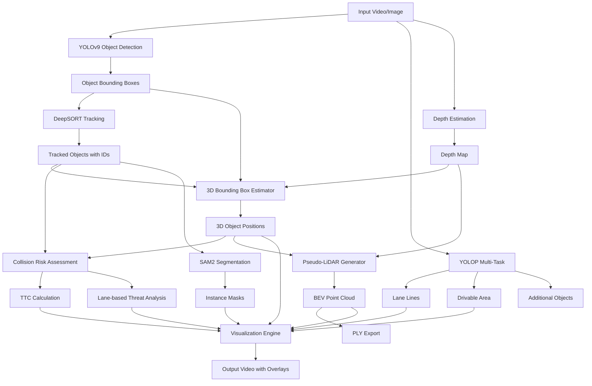

# Autonomous Vehicle Perception System

A comprehensive real-time perception system for autonomous vehicles that integrates multiple deep learning models for object detection, tracking, depth estimation, semantic segmentation, and collision risk assessment.

## 🎯 Overview

This system provides a complete end-to-end perception pipeline for autonomous vehicles, combining:

- **Multi-task object detection** with YOLOv9 and YOLOP
- **Monocular depth estimation** using multiple state-of-the-art models
- **Multi-object tracking** with DeepSORT
- **Lane detection and drivable area segmentation**
- **3D bounding box estimation**
- **Collision risk assessment** with Time-to-Collision (TTC) calculations
- **Pseudo-LiDAR point cloud generation**
- **Instance segmentation** with SAM2

## 🌟 Key Features

- ✅ Real-time video processing
- ✅ 3D scene reconstruction from monocular camera
- ✅ Multi-object tracking with unique IDs
- ✅ Lane-based threat assessment
- ✅ Dynamic depth correction using reference objects
- ✅ Point cloud export (PLY format)
- ✅ Comprehensive logging and analytics
- ✅ Bird's-eye-view (BEV) visualization

## 🏗️ System Architecture



## 🧮 Mathematical Foundations

### 1. Depth Estimation and 3D Reconstruction

The system converts 2D bounding boxes to 3D using pinhole camera model:

**Pinhole Camera Projection:**
```
u = (fx * X) / Z + cx
v = (fy * Y) / Z + cy
```

Where:
- `(u, v)` = pixel coordinates
- `(X, Y, Z)` = 3D world coordinates
- `fx, fy` = focal lengths
- `cx, cy` = principal point (image center)

**Depth from Bounding Box Width:**
```
Z = (W_real * fx) / W_pixel
```

Where:
- `Z` = depth (distance to object)
- `W_real` = real-world width of object (m)
- `W_pixel` = bounding box width in pixels
- `fx` = focal length in pixels

**Dynamic Focal Length Calibration:**
```
fx_calibrated = (Z_reference * W_pixel_reference) / W_real_reference
```

### 2. Time-to-Collision (TTC)

**Basic TTC Calculation:**
```
TTC = -d / v_rel
```

Where:
- `d` = current distance between vehicles (m)
- `v_rel` = relative velocity (m/s)

**Enhanced TTC with Acceleration:**
```
TTC = (-v_rel + sqrt(v_rel² + 2 * a_rel * d)) / a_rel
```

Where:
- `a_rel` = relative acceleration (m/s²)

**Smoothed Velocity Estimation:**
```
v_t = α * v_measured + (1 - α) * v_t-1
```

Where:
- `α` = smoothing factor (0.3)
- `v_t` = current velocity
- `v_t-1` = previous velocity

### 3. 3D Bounding Box Vertices

**Ground Plane Vertices (Bottom):**
```
vertices_bottom = [
    [x - w/2, y, z - l/2],  # Front-left
    [x + w/2, y, z - l/2],  # Front-right
    [x + w/2, y, z + l/2],  # Back-right
    [x - w/2, y, z + l/2]   # Back-left
]
```

**Top Vertices:**
```
vertices_top = vertices_bottom + [0, -h, 0]
```

Where:
- `(x, y, z)` = 3D center position
- `w, h, l` = width, height, length

### 4. Pseudo-LiDAR Point Cloud Generation

**3D Point Reconstruction:**
```
X = (u - cx) * Z / fx
Y = (v - cy) * Z / fy
```

**Rotation to Camera Frame:**
```
[X_cam]   [1   0      0   ] [X]
[Y_cam] = [0  -1      0   ] [Y]
[Z_cam]   [0   0     -1   ] [Z]
```

### 5. Lane Position Calculation

**Normalized Lateral Position:**
```
lateral_position = (x_center - image_width/2) / (image_width/2)
```

Lane assignment:
- `lateral_position < -0.3`: Left lane
- `-0.3 ≤ lateral_position ≤ 0.3`: Center lane  
- `lateral_position > 0.3`: Right lane

### 6. Collision Risk Scoring

**Risk Level Calculation:**
```
if TTC < 2.0:
    risk = "CRITICAL"
elif TTC < 4.0:
    risk = "HIGH"
elif TTC < 6.0:
    risk = "MEDIUM"
else:
    risk = "LOW"
```

**Distance-based Following Risk:**
```
safe_distance = max(v_ego * time_headway, min_safe_distance)
risk_factor = safe_distance / actual_distance
```

## 📦 Models and Sources

### Object Detection

#### YOLOv9
- **Paper:** "YOLOv9: Learning What You Want to Learn Using Programmable Gradient Information"
- **Source:** [WongKinYiu/yolov9](https://github.com/WongKinYiu/yolov9)
- **Model Files:** `yolov9-c.pt`, `yolov9-e.pt`
- **Purpose:** Primary object detection (vehicles, pedestrians, cyclists)

#### YOLOP
- **Paper:** "YOLOP: You Only Look Once for Panoptic Driving Perception"
- **Source:** [hustvl/YOLOP](https://github.com/hustvl/YOLOP)
- **Purpose:** Multi-task learning (detection + lane lines + drivable area)

### Depth Estimation

#### Depth Anything V2
- **Paper:** "Depth Anything V2"
- **Source:** [DepthAnything/Depth-Anything-V2](https://github.com/DepthAnything/Depth-Anything-V2)
- **Models:** `depth_anything_v2_vits.pth`, `depth_anything_v2_vitb.pth`, `depth_anything_v2_vitl.pth`
- **Purpose:** State-of-the-art monocular depth estimation

#### Depth Anything V3 (Optional)
- **Source:** Experimental depth estimation model
- **Purpose:** Enhanced depth estimation

#### Intel DPT (Dense Prediction Transformer)
- **Paper:** "Vision Transformers for Dense Prediction"
- **Source:** [Intel-isl/DPT](https://github.com/isl-org/DPT)
- **HuggingFace:** `Intel/dpt-large`, `Intel/dpt-hybrid-midas`
- **Purpose:** Alternative transformer-based depth estimation

### Object Tracking

#### DeepSORT
- **Paper:** "Simple Online and Realtime Tracking with a Deep Association Metric"
- **Source:** [ZQPei/deep_sort_pytorch](https://github.com/ZQPei/deep_sort_pytorch)
- **Purpose:** Multi-object tracking with Re-ID

### Instance Segmentation

#### SAM2 (Segment Anything Model 2)
- **Paper:** "Segment Anything in Images and Videos"
- **Source:** [facebookresearch/segment-anything-2](https://github.com/facebookresearch/segment-anything-2)
- **Models:** `sam2_t.pt`, `sam2_s.pt`, `sam2_b.pt`, `sam2_l.pt`
- **Purpose:** Zero-shot instance segmentation

## 🔧 Installation

### Prerequisites

```bash
# CUDA-enabled GPU recommended
# Python 3.8+
# CUDA 11.x or higher
```

### Clone Repository

```bash
git clone https://github.com/yourusername/av-perception-system.git
cd av-perception-system
```

### Install Dependencies

```bash
pip install -r requirements.txt
```

**Required Packages:**
```
torch>=2.0.0
torchvision>=0.15.0
numpy>=1.21.0
opencv-python>=4.7.0
ultralytics>=8.0.0
transformers>=4.30.0
huggingface-hub>=0.16.0
pillow>=9.0.0
scipy>=1.9.0
pyyaml>=6.0
```

### Download Model Weights

```bash
# YOLOv9 weights
wget https://github.com/WongKinYiu/yolov9/releases/download/v0.1/yolov9-c.pt

# Depth Anything V2
wget https://huggingface.co/depth-anything/Depth-Anything-V2-Small/resolve/main/depth_anything_v2_vits.pth

# SAM2 weights (automatically downloaded by ultralytics)
# Will be downloaded on first run

# DeepSORT weights
cd deep_sort_pytorch
# Download ckpt.t7 from repository
```

### Directory Structure

```
av-perception-system/
├── av_perception_system.py      # Main script
├── requirements.txt
├── deep_sort_pytorch/
│   ├── deep_sort/
│   └── configs/
├── YOLOP/
│   ├── lib/
│   └── weights/
├── Depth-Anything-V2/
│   └── depth_anything_v2/
├── models/                       # YOLOv9 models
├── utils/                        # Helper utilities
├── data/
│   └── videos/                   # Input videos
└── runs/
    └── detect/                   # Output results
```

## 🚀 Usage

### Basic Usage

```bash
python av_perception_system.py \
    --weights yolov9-c.pt \
    --source data/videos/dashcam.mp4 \
    --device 0
```

### Advanced Options

```bash
python av_perception_system.py \
    --weights yolov9-c.pt \
    --source data/videos/traffic.mp4 \
    --device 0 \
    --conf-thres 0.25 \
    --iou-thres 0.45 \
    --save-frames \
    --draw-trails \
    --view-img \
    --pixels-per-meter 20
```

### Command-Line Arguments

| Argument | Type | Default | Description |
|----------|------|---------|-------------|
| `--weights` | str | `yolo.pt` | Path to model weights |
| `--source` | str | `data/images` | Input source (video/image/webcam) |
| `--device` | str | `''` | CUDA device (0/1/2/cpu) |
| `--conf-thres` | float | 0.25 | Confidence threshold |
| `--iou-thres` | float | 0.45 | NMS IoU threshold |
| `--imgsz` | int | 640 | Inference image size |
| `--save-frames` | flag | False | Save individual frames |
| `--draw-trails` | flag | False | Draw tracking trails |
| `--view-img` | flag | False | Display results |
| `--pixels-per-meter` | int | 20 | Depth calibration factor |
| `--classes` | list | None | Filter specific classes |
| `--max-det` | int | 1000 | Maximum detections per image |

### Webcam Usage

```bash
python av_perception_system.py \
    --weights yolov9-c.pt \
    --source 0 \
    --device 0 \
    --view-img
```

## 📊 Outputs

### Visualization Components

1. **Main Video Frame**
   - Bounding boxes with class labels
   - Tracking IDs
   - Distance measurements
   - 3D bounding box projections

2. **Depth Map Overlay** (top-right)
   - Color-coded depth visualization
   - Plasma colormap

3. **Bird's-Eye-View (BEV)** (bottom-left)
   - Rolling pseudo-LiDAR point cloud
   - Vehicle positions from ego perspective

4. **Lane Detection**
   - Lane line overlays
   - Drivable area segmentation

5. **Threat Indicators**
   - TTC warnings
   - Risk level indicators
   - Lane change detection

### Exported Files

```
runs/detect/exp/
├── video_output.mp4              # Processed video with overlays
├── frames/
│   ├── frame_000001.jpg         # Individual frames (if --save-frames)
│   ├── frame_000002.jpg
│   └── ...
├── pointclouds/
│   ├── frame_000001_textured.ply    # Textured point cloud
│   ├── frame_000001_semantic.ply    # Semantic point cloud
│   └── ...
└── depth_log.csv                 # Depth estimation log
```

### CSV Log Format

```csv
frame_id,object_id,class_id,label,bbox_width_px,raw_depth_m,corrected_depth_m,fx_estimated,fx_nominal
1,0,2,car,245,15.3,14.8,650.2,640.0
1,1,2,car,180,22.1,21.5,652.8,640.0
```

## 🎨 Visualization

### Color Codes

- **Green Boxes:** Low risk objects (TTC > 6s)
- **Yellow Boxes:** Medium risk (4s < TTC ≤ 6s)
- **Orange Boxes:** High risk (2s < TTC ≤ 4s)
- **Red Boxes:** Critical risk (TTC ≤ 2s)

### Display Information

```
┌─────────────────────────────────────────┐
│ [ID: 5] Car - 12.5m - 45 km/h          │
│ TTC: 3.2s | Lane: Center | RISK: HIGH  │
└─────────────────────────────────────────┘
```

## ⚙️ Configuration

### Camera Calibration

Modify intrinsic parameters in the code:

```python
# Default camera parameters
fx = 640.0  # Focal length x
fy = 640.0  # Focal length y
cx = 320.0  # Principal point x
cy = 240.0  # Principal point y
```

### Reference Object Dimensions

Standard vehicle dimensions used for depth calibration:

```python
REFERENCE_DIMENSIONS = {
    'car': {'width': 1.8, 'height': 1.5, 'length': 4.5},
    'truck': {'width': 2.5, 'height': 3.0, 'length': 8.0},
    'bus': {'width': 2.5, 'height': 3.2, 'length': 12.0},
    'person': {'width': 0.5, 'height': 1.7, 'length': 0.3}
}
```

### Risk Thresholds

Adjust collision risk parameters:

```python
TTC_CRITICAL = 2.0  # seconds
TTC_HIGH = 4.0      # seconds  
TTC_MEDIUM = 6.0    # seconds
SAFE_FOLLOWING_DISTANCE = 2.0  # seconds headway
```

## 🔬 Technical Details

### Pipeline Processing Flow

1. **Frame Acquisition**
   - Load video frame or webcam feed
   - Preprocessing and resizing

2. **Multi-Model Inference**
   - YOLOv9: Object detection
   - YOLOP: Lane lines + drivable area
   - Depth Estimation: Generate depth map

3. **Object Tracking**
   - DeepSORT: Associate detections across frames
   - Track ID assignment and management

4. **3D Reconstruction**
   - Estimate 3D bounding boxes
   - Calculate object positions in camera coordinates
   - Generate pseudo-LiDAR points

5. **Risk Assessment**
   - Calculate TTC for each tracked object
   - Analyze lane positions
   - Detect lane changes and lateral movements

6. **Visualization**
   - Overlay all detection/tracking results
   - Generate BEV visualization
   - Composite final output frame

### Performance Optimization

- **FP16 Inference:** Use `--half` flag for 2x speedup
- **Batch Processing:** Process multiple frames simultaneously
- **Dynamic Batching:** Adjust batch size based on GPU memory
- **Frame Skipping:** Use `--vid-stride` to process every Nth frame

### Accuracy Improvements

1. **Depth Correction**
   - Dynamic calibration using reference objects
   - Temporal smoothing with exponential moving average

2. **Multi-Model Fusion**
   - Ensemble predictions from YOLOv9 + YOLOP
   - Cross-validation of detections

3. **Tracking Robustness**
   - DeepSORT Re-ID features
   - Kalman filtering for position prediction

## 🐛 Troubleshooting

### Common Issues

**1. CUDA Out of Memory**
```bash
# Reduce image size
--imgsz 480

# Use CPU
--device cpu

# Enable FP16
--half
```

**2. Model Download Failures**
```bash
# Manually download models
# Check internet connection
# Use alternative mirror
```

**3. Depth Estimation Issues**
```bash
# Try different depth model
# Adjust --pixels-per-meter calibration
# Ensure proper lighting conditions
```

**4. Tracking ID Switches**
```bash
# Increase confidence threshold
--conf-thres 0.35

# Adjust IoU threshold
--iou-thres 0.5
```

## 📚 References

### Papers

1. **YOLOv9:** Wang et al., "YOLOv9: Learning What You Want to Learn Using Programmable Gradient Information" (2024)

2. **YOLOP:** Wu et al., "YOLOP: You Only Look Once for Panoptic Driving Perception" (2021)

3. **Depth Anything V2:** Yang et al., "Depth Anything V2" (2024)

4. **DeepSORT:** Wojke et al., "Simple Online and Realtime Tracking with a Deep Association Metric" (2017)

5. **SAM2:** Ravi et al., "Segment Anything in Images and Videos" (2024)

6. **DPT:** Ranftl et al., "Vision Transformers for Dense Prediction" (2021)

### Datasets

- **COCO:** Common Objects in Context
- **KITTI:** Karlsruhe Institute of Technology and Toyota Technological Institute
- **nuScenes:** Autonomous driving dataset
- **BDD100K:** Berkeley DeepDrive

## 🤝 Contributing

Contributions are welcome! Please follow these steps:

1. Fork the repository
2. Create a feature branch (`git checkout -b feature/amazing-feature`)
3. Commit your changes (`git commit -m 'Add amazing feature'`)
4. Push to the branch (`git push origin feature/amazing-feature`)
5. Open a Pull Request

## 📄 License

This project is licensed under the MIT License - see the LICENSE file for details.

## 🙏 Acknowledgments

- YOLOv9 team for the excellent object detection model
- Depth Anything team for state-of-the-art depth estimation
- DeepSORT developers for robust tracking
- Meta AI for SAM2
- The open-source computer vision community

## 📧 Contact

For questions or collaboration:
- GitHub Issues: [Report issues here]
- Email: your.email@example.com

## 🔮 Future Work

- [ ] Multi-camera fusion
- [ ] Stereo depth estimation
- [ ] Real-time SLAM integration
- [ ] Trajectory prediction
- [ ] End-to-end learning pipeline
- [ ] ROS integration
- [ ] Edge device deployment (Jetson, etc.)

---

**Note:** This system is for research and educational purposes. For safety-critical applications, extensive validation and testing are required.
