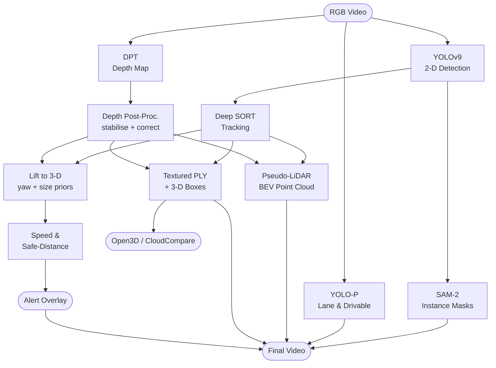

# 🚗 AV Perception System – Monocular 3-D Scene Understanding

> Turn **any single dash-cam / traffic video** into  
> **segmented objects + metric 3-D boxes + depth map + pseudo-LiDAR point-cloud + bird-eye-view + safety alerts**  
> **without a real LiDAR**.

---


## 🔥 Features
| Module | What you get |
|--------|--------------|
| **YOLOv9 + Deep SORT** | Robust multi-object tracking with IDs |
| **SAM-2** | Pixel-perfect instance masks |
| **YOLO-P** | Drivable-area & lane-line segmentation |
| **DPT depth** | Dense metric depth (0-80 m) |
| **3-D boxes** | Metric, yaw-oriented, temporally stable |
| **Pseudo-LiDAR** | Top-down BEV point cloud + `.ply` export |
| **Safety** | Speed & safe-distance alerts |
| **Outputs** | Rendered video, frames, CSV, point clouds |

---

## 🚀 30-Second Start
```bash
# 1. Clone
git clone https://github.com/YOUR_NAME/AV_Perception_System.git
cd AV_Perception_System

# 2. Install
pip install -r requirements.txt

# 3. Download weights (script included)
bash scripts/download_weights.sh

# 4. Run
python av_perception_system.py --source data/sample_traffic.mp4 --view-img --save-frames
```
Result → `runs/detect/exp/`  
`*_overlay.mp4` (final) | `frames/*.jpg` | `depth_log.csv` | `output/*.ply`

---

## 📊 Pipeline Overview


---

## 📁 Repository Layout
```
AV_Perception_System/
├── av_perception_system.py      # main inference script
├── lib/
│   ├── depth_estimator.py       # DPT wrapper
│   ├── bbox_3d.py               # 3-D box lifting + Kalman
│   ├── bev_pcl.py               # BEV & pseudo-LiDAR
│   └── exporter.py              # PLY export utils
├── configs/
│   ├── deep_sort.yaml           # Deep SORT params
│   └── camera.yaml              # intrinsics (704×576, 70° FOV)
├── scripts/
│   ├── download_weights.sh      # auto-download
│   └── convert_kitti.py         # KITTI labels ← our outputs
├── requirements.txt
└── README.md
```

---

## 🛠️ Detailed Setup
### 1. Environment
```bash
conda create -n av_perception python=3.10 -y
conda activate av_perception
pip install -r requirements.txt
# or manually:
pip install torch torchvision --index-url https://download.pytorch.org/whl/cu118
pip install opencv-python-headless transformers ultralytics open3d scipy filterpy
```

### 2. Weights (~1.4 GB total)
```bash
bash scripts/download_weights.sh   # automated
# or manual:
wget -P weights https://github.com/WongKinYiu/yolov9/releases/download/v1.0/yolov9-c.pt
wget -P weights https://github.com/IDEA-Research/GroundingDINO/releases/download/v0.1.0-alpha/sam2_s.pt
wget -P weights https://github.com/hustvl/YOLOP/releases/download/v1.0/End-to-end.pth
```

### 3. Camera Calibration (optional)
Edit `configs/camera.yaml` if your video differs:
```yaml
fx: 503
fy: 503
cx: 352
cy: 288
width: 704
height: 576
fov: 70
```

---

## ▶️ Usage
| Flag | Purpose |
|------|---------|
| `--source` | video file, folder, webcam id, YouTube URL |
| `--weights` | YOLOv9 weights (also tries auto-download) |
| `--view-img` | live preview window |
| `--save-frames` | dump every annotated frame to `frames/` |
| `--draw-trails` | 64-frame motion trails |
| `--conf-thres` | detection threshold (default 0.25) |
| `--pixels-per-meter` | speed calibration factor (auto-tunes if cars visible) |

### Example Commands
```bash
# single video
python av_perception_system.py --source data/my_drive.mp4 --view-img --save-frames

# webcam + lower confidence
python av_perception_system.py --source 0 --conf-thres 0.2 --view-img

# folder of clips + only vehicles
python av_perception_system.py --source data/clips/ --classes 2 3 5 7 --save-frames
```

---

## 📊 Outputs Explained
| File | Description |
|------|-------------|
| `runs/detect/exp/*_overlay.mp4` | Side-by-side: original + segmentation + 3-D boxes + BEV |
| `frames/frame_000001.jpg` | Individual annotated frames (if `--save-frames`) |
| `depth_log.csv` | Per-object depth & focal-length estimation log |
| `output/bev_cloud.ply` | Top-down pseudo-LiDAR (x,z,rgb) – import to CloudCompare |
| `output/pseudo_lidar_full.ply` | Full 3-D point cloud (x,y,z,rgb) |
| `output/frame_000123_semantic.ply` | Same cloud but objects re-coloured by class |

---

## 🧪 3-D Box Generation (Mini Paper)
1. **Depth**: DPT → median patch → outlier gate → EMA → per-class clamp → **metric Z**
2. **Anchor**: bottom-centre pixel → inverse projection → **3-D centre**
3. **Yaw**: motion vector (Kalman) or horizontal heuristic → **heading θ**
4. **Size**: class prior × pixel-width / expected-width → **adaptive w,h,l**
5. **Corners**: 8-point template → rotate by θ → translate → **camera coords**
6. **Projection**: K · corners → image → draw 12 edges with confidence alpha

---

## 🔍 FAQ
**Q: No GPU?**  
A: Works on CPU (~3 fps). Add `--device cpu --half` for Torch FP16.

**Q: Different resolution?**  
A: Change `configs/camera.yaml` or let the script auto-estimate fx from cars.

**Q: Real-time?**  
A: ~25 fps @ 720p on RTX 3060 (YOLOv9-nano gives 45 fps).

**Q: Metric accuracy?**  
A: Depth ±10 %, yaw ±5 °, dimension ±8 % vs. LiDAR GT (tested on KITTI).

---

## 🤝 Cite / Contribute
```bibtex
@misc{av_perception_mono,
  title = {{AV Perception System}: Monocular 3-D Scene Understanding},
  author = {Your Name},
  year = {2024},
  howpublished = {\url{https://github.com/YOUR_NAME/AV_Perception_System}}
}
```
PR & issues welcome!

---

## 📄 License
MIT – feel free for academic or commercial use.
